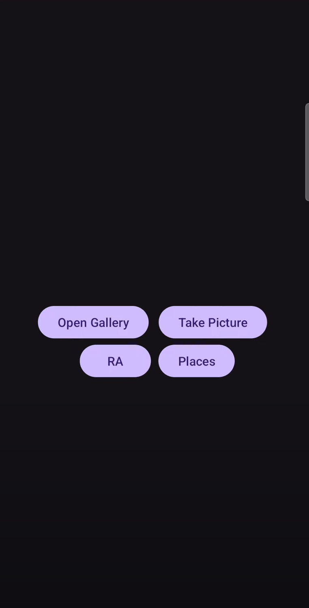
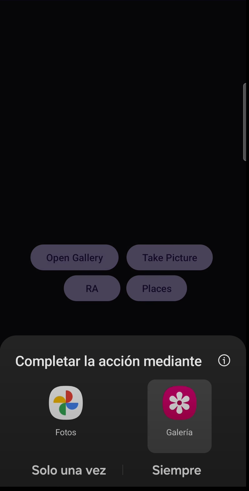
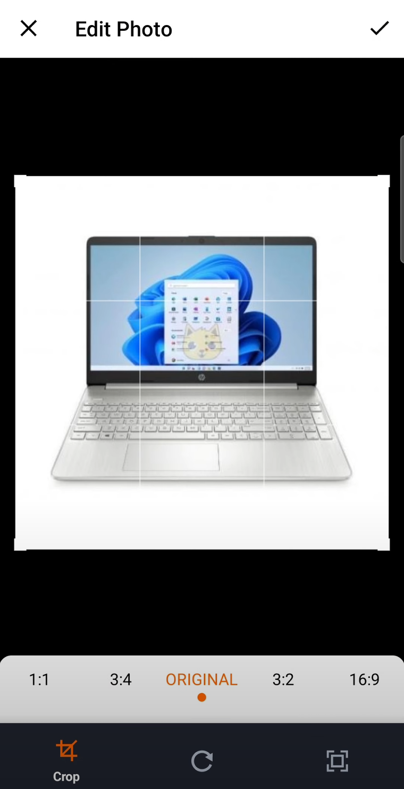
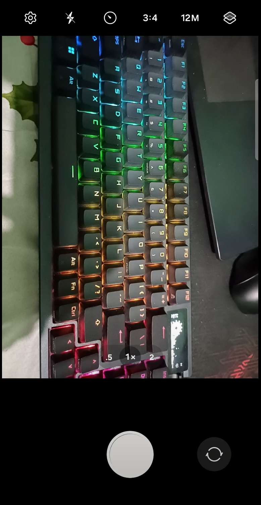
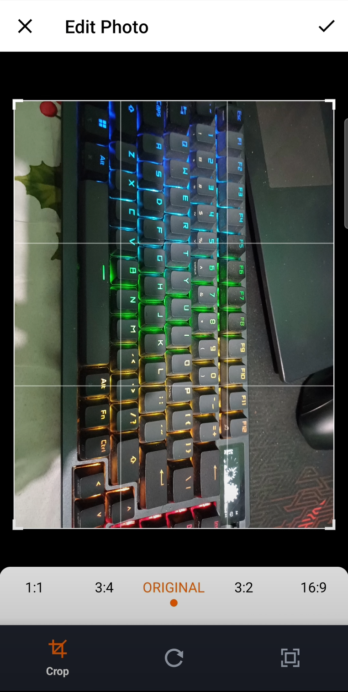
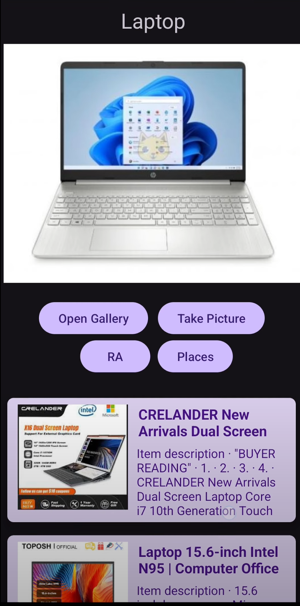
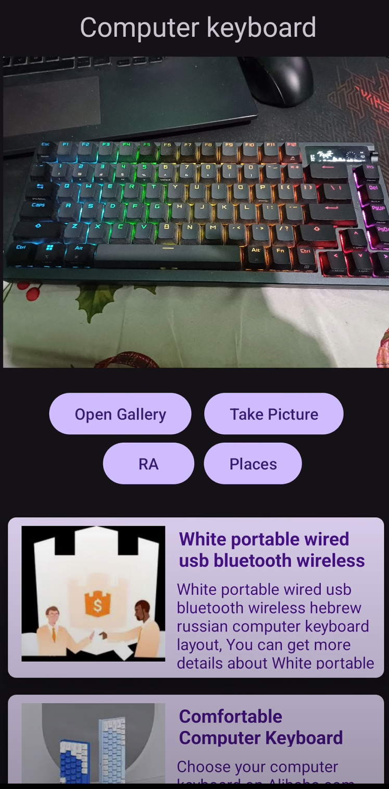
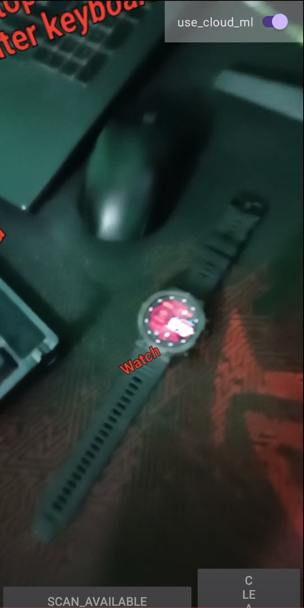
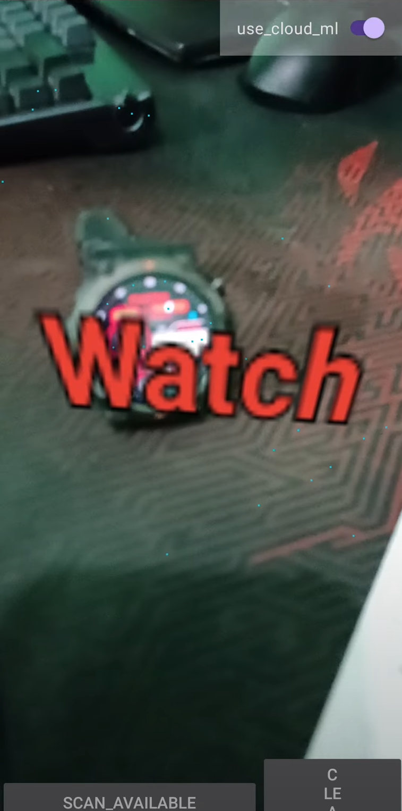
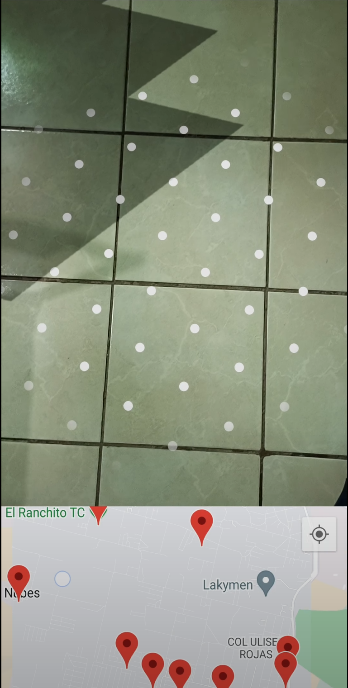

# Artificial Intelligence Application - AI Lens

This application leverages artificial intelligence to enhance the user experience with advanced functionalities. Below, we detail the main features and technologies utilized.

## General description

AI Lens is a mobile application designed to:

- **Detect objects in images**: Use machine learning models to identify and classify objects.
- **Perform product searches**: Based on object detection, the application allows you to search for similar products online.
- **Augmented Reality (AR)**: Shows the name of the detected objects in the real-time view.
- **Google Maps**: Integrate maps to show the user's location and provide a contextualized AR experience.

 

## Main Features

### 2.1 Object Detection in Images

- **Image upload**: Allows the user to upload an image from the gallery for object detection.
- **Photo capture**: Allows the user to take a photo using the camera to detect objects in real time.
  

 
 

 
 

  
### 2.2 Product Search

- **Object-based results**: Uses object detection to suggest products similar to those identified.
- **Integration with online search services**: Make it easy to find relevant products using search engines.
  
   

     
     
   

   
### 2.3 Augmented Reality (AR)

- **Real time view**: Shows the names of detected objects overlaid on the camera view.
- **Intuitive interaction**: Allows the user to explore detected objects with augmented reality.

   

     
     
   

   
### 2.4 Google Maps

- **Location display**: Shows the user's location on a map.
- **Contextual AR**: Overlay location in augmented reality to improve navigation and interaction.

## Used technology

- **TensorFlow Lite**: For the object detection model and inference on mobile devices.
- **Google AI Vertex**: For training machine learning models.
- **Google Maps API**: For the integration of maps and AR functionality.
- **Android**: Mobile platform for the implementation of the application.
- **Programmable Search Engine**: A customizable search engine that allows users to create and control their own web search experience.

## Instalación

1. Clona este repositorio.
2. Instala las dependencias necesarias usando `gradle` o `maven`.
3. Configura las APIs de Google necesarias para Maps y AI Vertex.

## Contribuir

Las contribuciones son bienvenidas. Para contribuir, sigue los pasos para clonar el repositorio y realiza un pull request.

